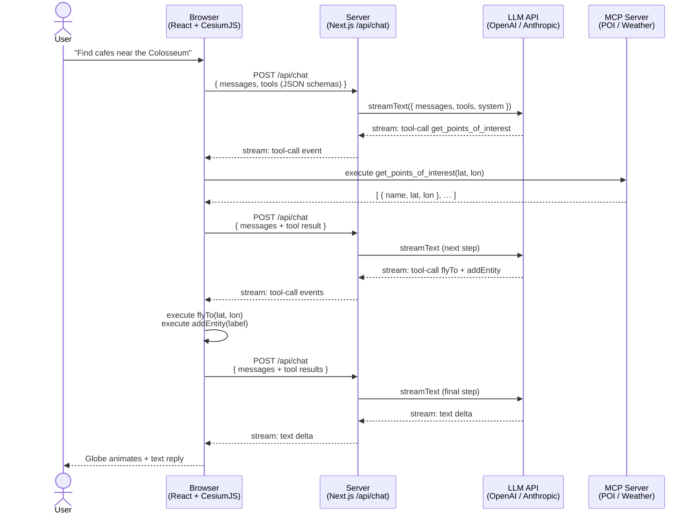

# Cesium Developer Conference 2026 — Workshop

**Building Your First AI-Driven Geospatial App with LLMs and Cesium**

This repository contains all workshop materials for the Cesium Developer Conference 2026 hands-on session.

---

## Quick start

All lab instructions, code, and assets live in the [`workshop/`](workshop/) folder.

👉 **[Go to the workshop README](workshop/README.md)**

---

## Repository structure

```
workshop/
├── LAB_1.md                # Lab 1 instructions
├── LAB_2.md                # Lab 2 instructions
├── LAB_3.md                # Lab 3 instructions
├── LAB_4_challenge.md      # Lab 4 challenge instructions
├── README.md               # Workshop overview, setup, and schedule
├── TROUBLESHOOTING.md      # Common issues and fixes
├── lab1_lab2/              # Starter app for Labs 1 & 2
├── lab3_lab4/              # Starter app for Labs 3 & 4
├── lab4_mcps/              # Reference MCP server implementations
└── labs_completed/         # Completed reference solutions
```

---

## Prerequisites

| Requirement | Notes |
|---|---|
| **VS Code** | [code.visualstudio.com](https://code.visualstudio.com/) |
| **Node.js ≥ 22 LTS** | [nodejs.org](https://nodejs.org/) |
| **pnpm 9.15.5** | `npm install -g pnpm@9.15.5` |
| **An OpenAI or Anthropic API key** | Will be provided during the workshop |

See [workshop/README.md](workshop/README.md) for full setup instructions.

---

## How it works



> AI inference runs server-side so API keys never reach the browser. Tool `execute` functions (camera, entities, etc.) run client-side against the live CesiumJS viewer.
