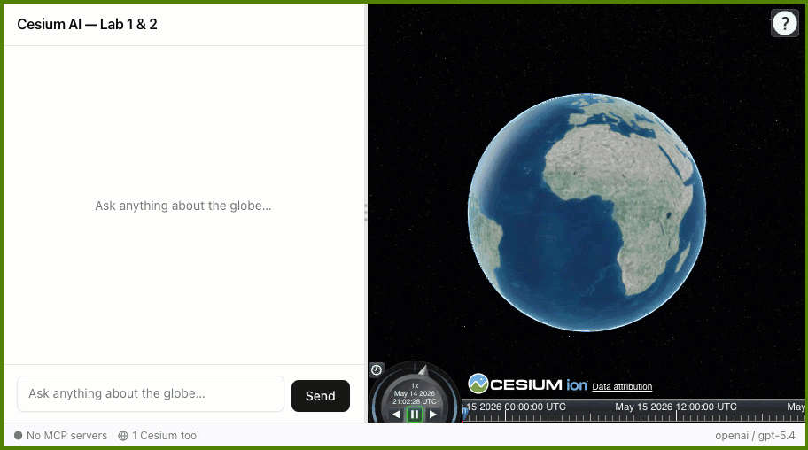
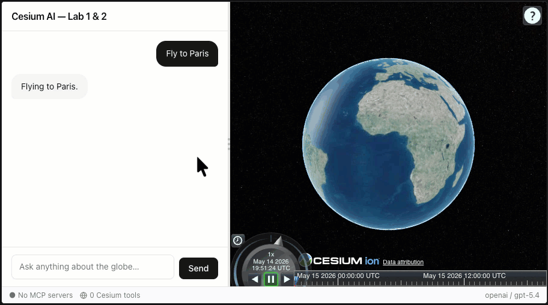
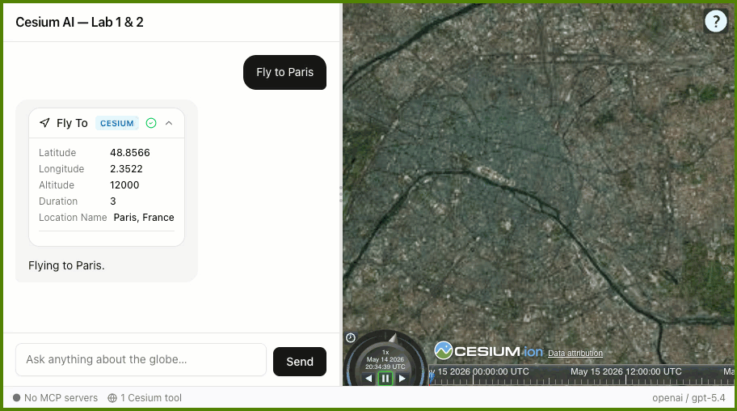

# Lab 1 — Our first Cesium tool

**Time:** ~15 minutes | **Required workspace:** `workshop/lab1_lab2/`

---

## Overview


In this lab we will learn about tool calling. This is one of the simplest ways to give an LLM some control over its environment. The moment you give it a *tool* — a function it is allowed to call — it stops being a text generator and starts being an agent that acts on the world. This lab adds the very first tool: the ability to move the camera. One tool is all it takes to cross that line.

We are starting with the 3D globe and chat already built and running. The agent can answer questions, but there is no meaningful connection between it and the globe yet.

**In this lab you will:**

- Create a camera helper that wraps a core CesiumJS function call.
- Define a `flyTo` AI tool that calls that helper.
- Wire the tool into the chat agent.

By the end, the prompt **"Fly to Paris"** will animate the globe camera.



**What's already implemented:**

| Feature | Status | Source code |
|---|---|---|
| CesiumJS globe | Running | [src/components/cesium/CesiumViewer.tsx](lab1_lab2/src/components/cesium/CesiumViewer.tsx) |
| AI chat panel | Running | [src/components/chat/ChatPanel.tsx](lab1_lab2/src/components/chat/ChatPanel.tsx) |
| Cesium Tools panel | Ready - currently shows "No tools wired yet" | [src/components/cesium/CesiumToolsPanel.tsx](lab1_lab2/src/components/cesium/CesiumToolsPanel.tsx) |
| Status bar | Visible at the bottom | [src/components/layout/StatusBar.tsx](lab1_lab2/src/components/layout/StatusBar.tsx) |
| Cesium camera tool | Not wired yet - you will complete this | Cesium tools barrel: [`src/lib/ai/tools/cesium/index.ts`](lab1_lab2/src/lib/ai/tools/cesium/index.ts) |

---

## Section 1 — Setup (start here)

### Step 1 — Install dependencies

All of our work for this lab takes place inside the `lab1_lab2` directory. Switch to that directory in your terminal and install the node dependencies:

```bash
cd workshop/lab1_lab2
pnpm install
```

### Step 2 — Create your `.env` file

Add a new file called `.env` next to `.env.example`. The easiest way is to copy `.env.example` and rename it:

```bash
copy .env.example .env  # Windows
# cp .env.example .env  # macOS/Linux
```

> [!TIP]
>
> No terminal needed: in the VS Code file explorer, right-click `.env.example` → **Copy**, then right-click → **Paste**, and rename the copy to `.env`.

Then open `.env` and fill in your API key (your workshop organizer will provide the key, base URL, and model name):

```env
# Optional — some imagery/terrain features require a Cesium Ion token
CESIUM_ION_ACCESS_TOKEN=your_token_here

OPENAI_API_KEY=your_key_here
AI_BASE_URL=your_base_url_here
AI_MODEL=your_model_name_here
```

> [!NOTE]
>
> Using a workshop-provided key? The `OPENAI_API_KEY` is split for security: the first part was sent via email, and the last few characters are in the [setup gist](https://gist.github.com/tomdicarlo/64bec5132f8c93f3875607d6dac20e43). Concatenate both parts to form the complete key — no spaces and no quotes.
>
> Example: if the email part is `sk-abc123...` and the gist part is `xyz789`, the line becomes `OPENAI_API_KEY=sk-abc123...xyz789`.

### Step 3 — Start the app

> [!TIP]
>
> **Prefer not to use the command line?** In VS Code, open the Command Palette (`Ctrl+Shift+P` / `Cmd+Shift+P`), run **Tasks: Run Task**, and choose **"Lab 1 & 2: App (port 3000)"**. That starts the app for you, so you can skip the `pnpm dev` terminal command below. (You still need to run `pnpm install` and create `.env` once.)
>
> Lab 1 only needs the app — don't start the POI server yet (that's Lab 2).

```bash
pnpm dev
```

Once ready, the terminal will show something like:

```
▲ Next.js 16.2.6 (Turbopack)
- Local:         http://localhost:3000
- Network:       http://192.168.0.237:3000
- Environments: .env
✓ Ready in 2.9s
```

### Step 4 — Open the app

Open a browser and navigate to **http://localhost:3000**.

> [!IMPORTANT]
>
> Keep this terminal (or the VS Code task) running so the dev server stays up while you complete the lab.

**Files you will modify in this lab:**
- [`.env`](lab1_lab2/.env) - add (copy from `.env.example`)
- [`src/lib/ai/tools/cesium/camera-tools.ts`](lab1_lab2/src/lib/ai/tools/cesium/camera-tools.ts) - uncomment (pre-populated)
- the Cesium tools **barrel** file [`src/lib/ai/tools/cesium/index.ts`](lab1_lab2/src/lib/ai/tools/cesium/index.ts) - edit (replace stub with import)
- [`src/components/chat/ChatPanel.tsx`](lab1_lab2/src/components/chat/ChatPanel.tsx) - edit (wire tools into chat)

**Files you will read but not edit:**
- [`src/lib/cesium/camera.ts`](lab1_lab2/src/lib/cesium/camera.ts) - review only (pre-populated)

---

> [!NOTE]
>
> **Two kinds of steps in this lab.** Throughout these labs, watch for these badges on each section:
> - 📖 **Review only** — read and understand existing code. **You do not edit anything.**
> - ✏️ **You implement** — you actually change code here (uncomment a block, add an import, or edit a file).

## Section 2 — Verify the baseline functionality

In the chat panel, type:

> **"Fly to Paris"**

Notice the assistant responds with text, but the globe does not move.

Open [src/components/chat/ChatPanel.tsx](lab1_lab2/src/components/chat/ChatPanel.tsx#L40) and find the `tools: {}` line (look for the `👇 LAB 1` markers). This empty object tells us that no tools are registered yet.

Back in the app, look at the bottom left corner and find the status bar for MCP servers and tools. You can click on these to open a helpful debug panel describing what resources are currently connected to your LLM chat agent. Right now both lists should be empty.



> [!IMPORTANT]
>
> The globe stays at the default view because no camera tool is registered. The Cesium Tools panel confirms this by showing 0 tools.

---

## Section 3 — Review the camera helper

> 📖 **Review only** — read and understand this file. No edits needed.

Open [**`src/lib/cesium/camera.ts`**](lab1_lab2/src/lib/cesium/camera.ts) and review the pre-populated code. It exports a single `flyToLocation` function that wraps the CesiumJS `camera.flyTo` API:

```typescript
/** Fly the camera to a lat/lon coordinate. */
export async function flyToLocation(
  // Reference to the 3D viewer - used to call CesiumJS functions.
  viewer: CesiumType.Viewer,
  // All input parameters required and optional for flyTo.
  params: {
    latitude: number;     // latitude in degrees
    longitude: number;    // longitude in degrees
    altitude?: number;    // altitude in meters
    duration?: number;    // how long animation should last in seconds
  },
): Promise<void> {
  const Cesium = await import("cesium");
  // Instantiate variables with defaults for optional parameters.
  const { latitude, longitude, altitude = 1_000_000, duration = 3 } = params;

  // Execute the flyTo function and return an async promise.
  return new Promise((resolve, reject) => {
    viewer.camera.flyTo({
      // Destination is a Cartesian3 object calculated
      // using longitude, latitude, and altitude.
      destination: Cesium.Cartesian3.fromDegrees(longitude, latitude, altitude),
      duration,
      complete: resolve,
      cancel: reject,
    });
  });
}
```

No edits are needed here. Continue to Section 4.

This is the first layer we are adding on top of the CesiumJS API to translate the API into something our LLM agent can understand. The LLM can't pull off miracles on its own, but maybe if we give it the right tools...

---

## Section 4 — Define the AI tool

> ✏️ **You implement** — you uncomment a tool and edit the barrel file in this section.

A stub already exists in the Cesium tools **barrel** file [`src/lib/ai/tools/cesium/index.ts`](lab1_lab2/src/lib/ai/tools/cesium/index.ts#L10) with an empty implementation:

```typescript
// Current stub in cesium/index.ts (src/lib/ai/tools/cesium/index.ts)
function createCameraTools(_viewerRef: RefObject<Viewer | null>): Record<string, Tool> {
  // TODO (Lab 1): Implement your camera tools here
  return {};
}
```

You will replace that stub by creating a new tool file and importing it.

### Step 1 — Activate [`src/lib/ai/tools/cesium/camera-tools.ts`](lab1_lab2/src/lib/ai/tools/cesium/camera-tools.ts#L24)

This file is the container for all tools we want to implement related to camera control. It is pre-populated with a skeleton and a commented-out implementation.

The implementation is pre-written but commented out so you can read through each piece before making it active. **Uncomment the `createCameraTools` function** by removing the leading `// ` prefix from each line in the commented block. The real explanatory comments inside the block use the `/* ... */` style, so they remain comments after you uncomment. After uncommenting, your file should look like this:

> [!TIP]
>
> **Fast way to uncomment in VS Code:** select every line of the commented block, then press `Ctrl+/` (`Cmd+/` on macOS) to toggle the comments off all at once. (Or simply replace the whole file's contents with the code block below.)
>
> **Made a mistake?** Press `Ctrl+Z` (`Cmd+Z` on macOS) to undo and restore the file to its previous state.

```typescript
import { tool } from "ai";
import { z } from "zod";
import type { RefObject } from "react";
import type * as CesiumType from "cesium";
import { flyToLocation } from "@/lib/cesium/camera";

export function createCameraTools(
  viewerRef: RefObject<CesiumType.Viewer | null>,
) {
  return {
    /* The flyTo tool object - the only camera tool for now. */
    flyTo: tool({
      /* Natural language description of the flyTo tool. */
      description:
        "Fly the camera to a geographic location. " +
        "Use when the user asks to navigate, go to, show, or visit a place.",
      /* Defines the input parameters for this tool.
         z (or zod) is the library used to dynamically define the types. */
      inputSchema: z.object({
        latitude: z.number().describe("Decimal degrees, positive = north"),
        longitude: z.number().describe("Decimal degrees, positive = east"),
        altitude: z
          .number()
          .optional()
          .describe("Camera height above ground in metres. Default: 1 000 000"),
        duration: z
          .number()
          .optional()
          .describe("Flight duration in seconds. Default: 3"),
        locationName: z
          .string()
          .describe("Human-readable name shown in the result card"),
      }),
      /* The javascript function that'll be called when the tool is called.
         This is a wrapper around the function you wrote earlier that
         includes some logic to check whether the viewer is ready. */
      execute: async ({ latitude, longitude, altitude, duration }) => {
        const viewer = viewerRef.current;
        if (!viewer || viewer.isDestroyed()) {
          return { success: false, error: "Viewer not ready" };
        }
        await flyToLocation(viewer, { latitude, longitude, altitude, duration });
        return { success: true, latitude, longitude, altitude };
      },
    }),
  };
}
```

`createCameraTools` returns an object containing several `tools`. Take a moment to study the fields inside the `flyTo: Tool` object. Notice the natural language `description` of what the tool does. Notice the descriptions of each of the input parameters in `inputSchema` and the rules specifying what type the inputs have and whether or not they are optional. Keep this in mind as we will repeat this pattern soon to add more tools.

### Step 2 — Update the Cesium tools barrel [`src/lib/ai/tools/cesium/index.ts`](lab1_lab2/src/lib/ai/tools/cesium/index.ts#L11)

Completely remove the local `createCameraTools` stub function and add the following import pointing to your real implementation in `camera-tools.ts`:

```diff
+ import { createCameraTools } from "./camera-tools";

- /**
-  * Stub for camera tools — students will replace this with their implementation.
-  */
- function createCameraTools(_viewerRef: RefObject<Viewer | null>): Record<string, Tool> {
-   // TODO (Lab 1): Implement your camera tools here
-   return {};
- }
```

<details>
<summary>Full file — copy-paste to avoid stub deletion mistakes (click to expand)</summary>

Replace the **entire contents** of `cesium/index.ts` with the following (the only change from the starter file is the first line — the import replaces the stub function):

```typescript
"use client";

import type { Tool } from "ai";
import type { RefObject } from "react";
import type { Viewer } from "cesium";
import { createCameraTools } from "./camera-tools";

export type CesiumToolCategoryKey = "camera";

export interface CesiumToolGroup {
  key: CesiumToolCategoryKey;
  title: string;
  tools: Record<string, Tool>;
}

/**
 * Build Cesium tools grouped by their owning domain module.
 *
 * Lab 1 — Camera tools only.
 */
export function createCesiumToolGroups(
  viewerRef: RefObject<Viewer | null>,
): CesiumToolGroup[] {
  return [
    { key: "camera", title: "Camera", tools: createCameraTools(viewerRef) },
  ];
}

/**
 * Assembles all Cesium viewer tools into a single map.
 */
export function createCesiumTools(viewerRef: RefObject<Viewer | null>): Record<string, Tool> {
  const groups = createCesiumToolGroups(viewerRef);
  const tools: Record<string, Tool> = {};
  for (const group of groups) {
    Object.assign(tools, group.tools);
  }
  return tools;
}
```

</details>

---

## Section 5 — Connect the tool to the LLM

> ✏️ **You implement** — you edit `ChatPanel.tsx` in this section.

Open **[src/components/chat/ChatPanel.tsx](lab1_lab2/src/components/chat/ChatPanel.tsx#L9)**. The file has inline `👇 LAB 1` anchor markers showing exactly where each change goes.

### Step 1 — Add imports at the top

Replace the `👇 LAB 1 — STEP 1` import marker with:

```typescript
import { useMemo } from "react";
import { useCesiumViewer } from "@/hooks/useCesiumViewer";
import { createCameraTools } from "@/lib/ai/tools/cesium/camera-tools";
```

### Step 2 — Replace `tools: {}`

Replace the `👇 LAB 1 — STEP 2` marker. The start of `ChatPanel` should read:

```typescript
export function ChatPanel() {
  const { viewerRef } = useCesiumViewer(); // add
  const tools = useMemo(() => createCameraTools(viewerRef), [viewerRef]); // add
  const { messages, status, error, sendMessage, abort, retry } = useAIChat({
    tools, // replace tools: {}
  });
  const { isOnline } = useNetworkStatus();
```

---

## Section 6 — Test out the tool

Make sure all your file edits are saved. Type **"Fly to Paris"** again. The globe should smoothly animate to Paris.

**Bonus:** Click the status bar at the bottom-right to open the **Cesium Tools** panel. Your `flyTo` tool should now appear with some documentation.

### Expected UI After Wiring `flyTo`



Congrats! The globe now moves because the LLM agent can call the `flyTo` tool and execute camera commands on the globe.

> [!TIP]
>
> **Exercises:** Try additional prompts
> - "Take me to Mount Fuji"
> - "Show me the Sahara Desert"
> - "Go to Sydney Harbour"
> - "Go to the place in the movie National Treasure where the clue hidden in the cipher on the back of the Declaration of Independence leads to next." 
>
> Observe how the LLM resolves natural-language place names into coordinates.

> [!NOTE]
> 
> You may notice the LLM might still be responding with text at times instead of calling the tool. That is expected. The **system prompt** isn't utilized properly yet to tailor the overall behavior of the agent. You will explore system prompts in [**Lab 3**](LAB_3.md).

---

## Section 7 — Optional experiments & bonus

<details>
<summary><strong>Tool descriptions matter</strong> — experiment with the <code>description</code> field (click to expand)</summary>

The `description` field is what the LLM reads to decide **when** to call a tool. It contains a 'trigger list' of phrases that have likely mappings to the tool.

- Remove `"show"` from the trigger list. Does "show me the Eiffel Tower" still call the tool?
- Change the `altitude` description. Does the model pick different altitudes for cities vs. continents?
- Make the description more restrictive, for example: "only call this for capital cities." What happens if you try to fly to a small town?

</details>

<details>
<summary><strong>BONUS — Zero-parameter <code>resetCamera</code> tool</strong> (click to expand)</summary>

> [!TIP]
>
> **Returning to this later?** Make sure the app is running first — see [Section 1 setup](#section-1--setup-start-here).

A tool doesn't need parameters to be useful. Adding a **zero-parameter** `resetCamera` tool proves that the LLM's tool-selection is driven entirely by the `description` field — no input schema gymnastics required.

### Implementation

Open [`src/lib/ai/tools/cesium/camera-tools.ts`](lab1_lab2/src/lib/ai/tools/cesium/camera-tools.ts#L24) and add a `resetCamera` entry inside the `return { ... }` block, after the closing `},` of the `flyTo` tool:

```typescript
resetCamera: tool({
  description:
    "Reset the globe camera to the default world view. " +
    "Use when the user asks to go back, reset, start over, " +
    "or see the whole Earth.",
  inputSchema: z.object({}),
  execute: async () => {
    const viewer = viewerRef.current;
    if (!viewer || viewer.isDestroyed()) {
      return { success: false, error: "Viewer not ready" };
    }
    viewer.camera.flyHome(2); // 2-second animation
    return { success: true, message: "Camera reset to default world view" };
  },
}),
```

### Test it

Save the file — the dev server picks up the change automatically. Try these prompts:

> - **"Go back to the start"**
> - **"Show me the whole Earth"**
> - **"Reset the view"**

The globe should animate back to its default position every time — even though the tool has no parameters and the LLM made its selection based only on the description.

### Expected result


> [!TIP]
>
> The LLM doesn't need coordinates or numbers to decide which tool to call. A well-written `description` is enough. This is a powerful design principle — keep tool selection logic in the description, not the schema.

</details>

---

## Section 8 — What's next

In [**Lab 2**](LAB_2.md), you will build an MCP server and connect it so the AI can call your external tools alongside the application's Cesium tools.
