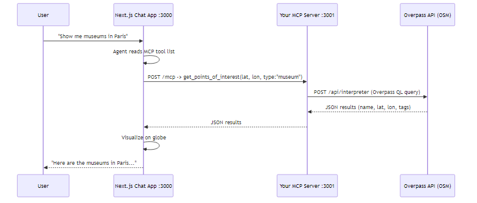
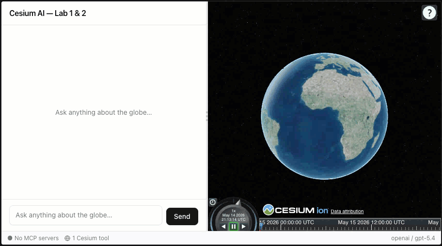
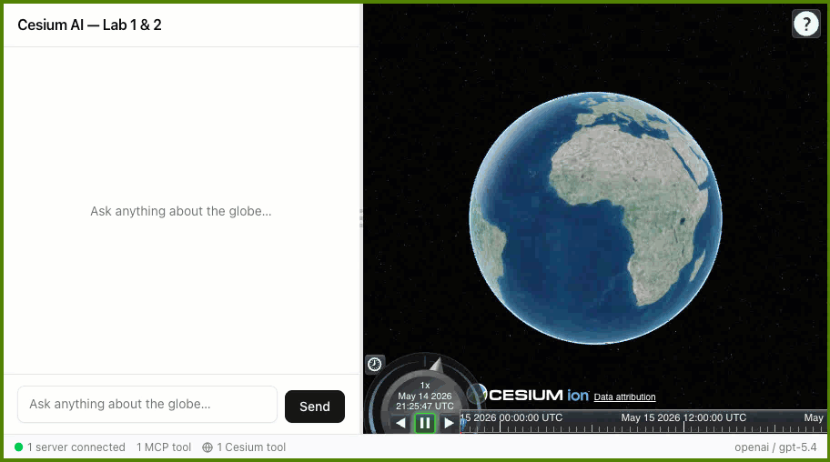
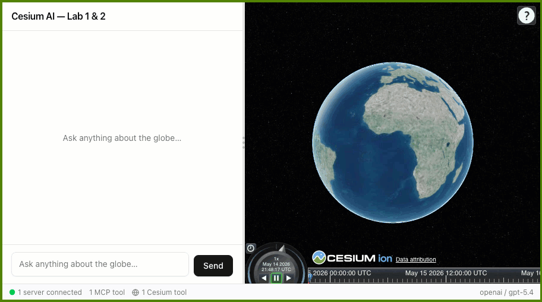
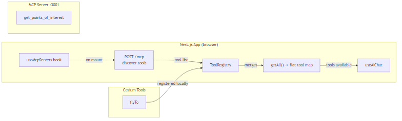
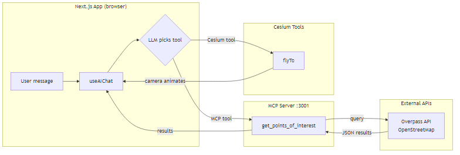
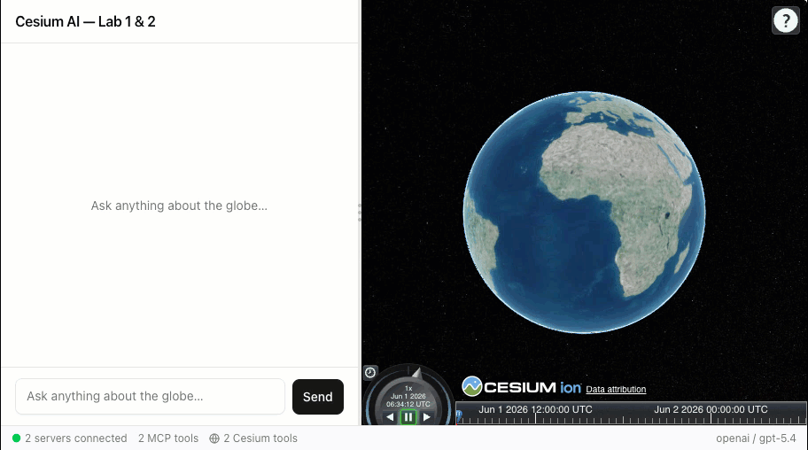

# Lab 2 — Build an MCP server

**Time:** ~20 minutes | **Required workspace:** `workshop/lab1_lab2/`

---

## Overview


The AI knows a lot from its training data, but that knowledge is frozen in time and occasionally wrong. Ask it "is it raining in Philadelphia right now?" and it will answer from memory — which may already be out of date by the time you read its reply. The fix is to stop relying on the AI's memory and instead give it a live data source it can query on demand.

### What is MCP?

**[MCP (Model Context Protocol)](https://modelcontextprotocol.io/docs/getting-started/intro)** is a standard way for LLM clients to discover and call tools exposed by external servers. Think of it like a USB port for AI: a standard plug that lets you connect any external data source — a map database, a weather service, a company spreadsheet — without rewriting your app each time. You build a tool once; any AI client that speaks the protocol can use it.

Instead of hardcoding every external request as a tool inside your chat app, you host tools on an MCP server and let any MCP-compatible client consume them.



### Goal

Lab 2 starts where Lab 1 left off. The `flyTo` Cesium tool is working, so the agent can move the camera.

**In this lab you will:**

- Build an external MCP server package from scratch.
- Add a real tool (`get_points_of_interest`) backed by [OpenStreetMap's Overpass API](https://wiki.openstreetmap.org/wiki/Overpass_API).
- Register the MCP server in the app.
- Wire MCP tools into the chat agent alongside existing Cesium tools.

By the end, prompts like **"Find attractions in Barcelona and fly to the first one"** should trigger both MCP and Cesium tools in one turn.

### What's already implemented

| Feature | Status | Source code |
|---|---|---|
| `flyTo` Cesium tool | Working from Lab 1 | [`src/lib/ai/tools/cesium/camera-tools.ts`](lab1_lab2/src/lib/ai/tools/cesium/camera-tools.ts) |
| MCP connection hook | Implemented | [`src/hooks/useMcpServers.ts`](lab1_lab2/src/hooks/useMcpServers.ts) |
| MCP status context | Implemented | [`src/contexts/McpStatusContext.tsx`](lab1_lab2/src/contexts/McpStatusContext.tsx) |
| MCP server config | Empty - ready for new MCP servers | [`src/lib/mcp-servers.config.ts`](lab1_lab2/src/lib/mcp-servers.config.ts) |
| Tool registry (merge Cesium + MCP) | Implemented | [`src/lib/ai/tools/registry.ts`](lab1_lab2/src/lib/ai/tools/registry.ts) |

The app currently looks like the end of Lab 1: `flyTo` works, but no external MCP tools are connected.



---

## Section 1 — Setup (start here)

Lab 2 continues in the same workspace as Lab 1: `workshop/lab1_lab2`. See [Lab 1 setup](LAB_1.md#section-1--setup-start-here) if you are behind.

### Step 1 — Start the app

> [!TIP]
>
> **Already have the app running from Lab 1?** The app is still running on port 3000 — skip the `pnpm dev` step below and go straight to [Section 2](#section-2--create-the-mcp-server). If you hit a port conflict on any port, run `npx kill-port 3000 3001 3002` to free them all, then restart.

If you closed the terminal from Lab 1, open a new terminal and start the app server again.

```bash
cd workshop/lab1_lab2
pnpm dev
```

> [!TIP]
>
> **Prefer not to use the command line?** In VS Code open the Command Palette (`Ctrl+Shift+P` / `Cmd+Shift+P`), run **Tasks: Run Task**, and choose **"Lab 1 & 2: Start app (port 3000)"** to start the app.

Once ready, the terminal will show something like:

```
▲ Next.js 16.2.6 (Turbopack)
- Local:         http://localhost:3000
- Network:       http://192.168.0.237:3000
- Environments: .env
✓ Ready in 2.9s
```

Open a browser and navigate to **http://localhost:3000**.

> [!IMPORTANT]
>
> Keep this app terminal running. You will open a second terminal soon for the MCP server.

**Files you will modify in this lab:**
- [`packages/mcp-poi/package.json`](lab1_lab2/packages/mcp-poi/package.json) - pre-populated (no edits needed)
- [`packages/mcp-poi/tsconfig.json`](lab1_lab2/packages/mcp-poi/tsconfig.json) - pre-populated (no edits needed)
- [`packages/mcp-poi/src/overpass.ts`](lab1_lab2/packages/mcp-poi/src/overpass.ts) - pre-populated (no edits needed)
- the MCP **tool-definitions** file [`packages/mcp-poi/src/tools/poi-tools.ts`](lab1_lab2/packages/mcp-poi/src/tools/poi-tools.ts) - uncomment (pre-populated)
- the MCP **server entry point** [`packages/mcp-poi/src/poi-server.ts`](lab1_lab2/packages/mcp-poi/src/poi-server.ts) - pre-populated (no edits needed)
- [`src/lib/mcp-servers.config.ts`](lab1_lab2/src/lib/mcp-servers.config.ts) - edit (register your MCP server)
- [`src/components/chat/ChatPanel.tsx`](lab1_lab2/src/components/chat/ChatPanel.tsx) - edit (merge MCP tools into chat)

---

> [!NOTE]
>
> **Two kinds of steps in this lab.** Watch for these badges on each step:
> - 📖 **Review only** — read and understand existing code. **You do not edit anything.**
> - ✏️ **You implement** — you actually change code here (uncomment a block, add an import, or edit a file).

## Section 2 — Create the MCP server

You will build a standalone MCP server package that queries OpenStreetMap Overpass for points of interest in order to supercharge the LLM agent's ability to precisely locate places and move the camera accordingly.

The `packages/mcp-poi/` directory is already scaffolded with `package.json`, `tsconfig.json`, and all source files pre-populated — and its dependencies were installed when you ran `pnpm install` in Section 1.

### Step 1 - Review the Overpass API client

> 📖 **Review only** — read and understand this file. No edits needed.

Open [`packages/mcp-poi/src/overpass.ts`](lab1_lab2/packages/mcp-poi/src/overpass.ts) and review the pre-populated code. It exposes two things: an interface for `PointOfInterest` responses and a `searchPois()` function that wraps the Overpass HTTP API. This is the equivalent of [`src/lib/cesium/camera.ts`](lab1_lab2/src/lib/cesium/camera.ts) from Lab 1 — infrastructure code you call from your tool.

```typescript
// Public Overpass endpoint used by this MCP server.
const OVERPASS_URL = "https://overpass-api.de/api/interpreter";

// Final shape returned to the MCP tool.
export interface PointOfInterest {
  id: number;
  name: string;
  latitude: number;
  longitude: number;
  type: string;
  tags: Record<string, string>;
}

export async function searchPois(
  latitude: number,
  longitude: number,
  type: string,
  radius: number = 5000,
): Promise<PointOfInterest[]> {
  // Build an Overpass QL query that searches nodes and ways across multiple tag groups.
  const query = `
    [out:json][timeout:10];
    (
      node["tourism"="${type}"](around:${radius},${latitude},${longitude});
      way["tourism"="${type}"](around:${radius},${latitude},${longitude});
      node["amenity"="${type}"](around:${radius},${latitude},${longitude});
      way["amenity"="${type}"](around:${radius},${latitude},${longitude});
      node["historic"="${type}"](around:${radius},${latitude},${longitude});
      way["historic"="${type}"](around:${radius},${latitude},${longitude});
    );
    out center body;
  `;
  // ...fetches from Overpass and returns normalised PointOfInterest[]
}
```

No edits are needed here. Continue to Step 2.

### Step 2 - Review the server entry point

> 📖 **Review only** — read and understand this file. No edits needed.

Open the MCP **server entry point** [`packages/mcp-poi/src/poi-server.ts`](lab1_lab2/packages/mcp-poi/src/poi-server.ts) and review the pre-populated code. It creates an Express app that hosts a `/mcp` endpoint. Because MCP is an open standard, we can rely on public libraries from `@modelcontextprotocol/sdk` for most of the heavy lifting.

```typescript
import { McpServer } from "@modelcontextprotocol/sdk/server/mcp.js";
import { StreamableHTTPServerTransport } from "@modelcontextprotocol/sdk/server/streamableHttp.js";
import express from "express";
import cors from "cors";
import { registerPoiTools } from "./tools/poi-tools.js";

const app = express();
const allowedOrigin = process.env.ALLOWED_ORIGIN ?? "http://localhost:3000";
app.use(cors({ origin: allowedOrigin }));
app.use(express.json());

app.post("/mcp", async (req, res) => {
  // Create a fresh MCP server reference object for this request and register tools.
  const server = new McpServer({ name: "poi-server", version: "1.0.0" });
  registerPoiTools(server);

  // Streamable HTTP transport handles the MCP protocol details.
  const transport = new StreamableHTTPServerTransport({ sessionIdGenerator: undefined });
  await server.connect(transport);
  await transport.handleRequest(req, res, req.body);
});

app.get("/mcp", (_req, res) => {
  res.status(405).set("Allow", "POST, DELETE").end();
});

app.delete("/mcp", (_req, res) => {
  res.status(200).end();
});

const PORT = process.env.PORT ? Number(process.env.PORT) : 3001;
app.listen(PORT, () => {
  console.log(`POI MCP server running on http://localhost:${PORT}/mcp`);
});
```

No edits are needed here. Continue to Step 3.

### Step 3 - Register the MCP tool

> ✏️ **You implement** — you uncomment the tool definition in this step.

Here we are defining the first tool on this MCP server. The syntax is slightly different from [`src/lib/ai/tools/cesium/camera-tools.ts`](lab1_lab2/src/lib/ai/tools/cesium/camera-tools.ts) in Lab 1, but the content should look familiar — a name, a description, input parameters with types, and an execute function.

Open the MCP **tool-definitions** file [`packages/mcp-poi/src/tools/poi-tools.ts`](lab1_lab2/packages/mcp-poi/src/tools/poi-tools.ts). The file has a skeleton and a commented-out implementation.

The implementation is pre-written but commented out so you can read through each piece before making it active. **Uncomment the `registerPoiTools` function** by removing the leading `// ` prefix from each line in the commented block. The real explanatory comments inside the block use the `/* ... */` style, so they remain comments after you uncomment. After uncommenting, your file should look like this:

> [!TIP]
>
> **Fast way to uncomment in VS Code:** select every line of the commented block, then press `Ctrl+/` (`Cmd+/` on macOS) to toggle the comments off all at once.

```typescript
import { McpServer } from "@modelcontextprotocol/sdk/server/mcp.js";
import { z } from "zod";
import { searchPois } from "../overpass.js";

// Register all POI-related tools on the MCP server instance.
export function registerPoiTools(server: McpServer) {
  server.registerTool(
    /* Tool name exposed over MCP. */
    "get_points_of_interest",
    {
      /* Tool description used by the LLM for intent matching. */
      description:
        "Search for real-world points of interest near a location using OpenStreetMap data. " +
        "Returns name, coordinates, and tags for each result. " +
        "Supported types include: museum, attraction, monument, restaurant, cafe, park, hotel, viewpoint, artwork, theatre.",
      /* Input schema defines arguments and descriptions for the model. */
      inputSchema: {
        latitude: z.number().describe("Center latitude (e.g. 48.8566 for Paris)"),
        longitude: z.number().describe("Center longitude (e.g. 2.3522 for Paris)"),
        type: z
          .string()
          .describe(
            "Type of POI to search for (e.g. 'museum', 'attraction', 'monument', 'restaurant', 'cafe', 'park')",
          ),
        radius: z
          .number()
          .optional()
          .describe("Search radius in meters (default 5000)"),
      },
    },
    async ({ latitude, longitude, type, radius }) => {
      /* Call the Overpass client and return the results as MCP text content. */
      const results = await searchPois(latitude, longitude, type, radius);
      return {
        content: [
          {
            type: "text" as const,
            text: JSON.stringify(results, null, 2),
          },
        ],
      };
    },
  );
}
```

### Step 4 - Start the MCP server

Open a new terminal window. Switch to the `mcp-poi` package directory and start the MCP server using the following commands:

```bash
cd workshop/lab1_lab2/packages/mcp-poi
pnpm dev
```

> [!TIP]
>
> **Prefer not to use the command line?** In VS Code open the Command Palette (`Ctrl+Shift+P` / `Cmd+Shift+P`), run **Tasks: Run Task**, and choose **"Lab 2: POI MCP server (port 3001)"** to start the MCP server.

By default the MCP server should be running on port 3001. Check the terminal to confirm the exact port that is being used.

---

## Section 3 — Register the server in the app

> ✏️ **You implement** — you edit `mcp-servers.config.ts` in this section.

Open [src/lib/mcp-servers.config.ts](lab1_lab2/src/lib/mcp-servers.config.ts#L9) and update `MCP_SERVERS`:

```typescript
export const MCP_SERVERS: McpServerConfig[] = [
  {
    label: "POI",
    transport: { type: "http", url: "http://localhost:3001/mcp" },
  },
];
```

> [!IMPORTANT]
>
> Make sure the port in the `url` matches the port printed in your terminal in the previous step.

After saving, **refresh the app in your browser** to pick up the new MCP server config, then check the MCP status panel — it should show the POI server as connected with its tool listed.



> [!NOTE]
>
> At this point the app can discover MCP tools, but chat still cannot call them yet. We still need to wire MCP tools into `useAIChat`.

---

## Section 4 — Wire MCP tools into ChatPanel

> ✏️ **You implement** — you edit `ChatPanel.tsx` in this section.

Let's switch contexts back to the application. Now we will add the scaffolding necessary for the chat to be able to discover our MCP server and use the server's tools.

Open [src/components/chat/ChatPanel.tsx](lab1_lab2/src/components/chat/ChatPanel.tsx). The inline `👇 LAB 2` anchor markers show exactly where each change goes.

> [!TIP]
>
> If you prefer to see the full picture first or get stuck at any point, jump to the [**Completed state**](#completed-state) at the bottom of this section.

### Step 1 - Add imports

Replace the `👇 LAB 2 — STEP 1` import marker with:

```typescript
import { useMcpServers } from "@/hooks/useMcpServers";
import { MCP_SERVERS } from "@/lib/mcp-servers.config";
import { ToolRegistry } from "@/lib/ai/tools";
```

### Step 2 - Add the MCP hook

```typescript
// Discover MCP tools from all configured MCP servers.
const { mcpTools } = useMcpServers({ servers: MCP_SERVERS });
```

### Step 3 - Create a registry that merges Cesium and MCP tools

```typescript
// Merge local Cesium tools and remote MCP tools into one registry.
const registry = useMemo(() => {
  return new ToolRegistry().registerMcp(mcpTools).registerCesium(tools);
}, [tools, mcpTools]);
```

### Step 4 - Pass merged tools to `useAIChat`

Replace the existing `useAIChat` call with:

```typescript
// tools and toolOrigins are now sourced from the merged registry.
const { messages, status, error, sendMessage, abort, retry } = useAIChat({
  tools: registry.getAll(),
  toolOrigins: registry.getOrigins(),
});
```

### Completed state

After all four steps, the top of `ChatPanel.tsx` should look like this — the lines marked with `// ← add this` are the ones you added:

```typescript
"use client";

import { useMemo } from "react";
import { AlertCircle, RefreshCw, WifiOff } from "lucide-react";
import { useAIChat } from "@/hooks/useAIChat";
import { useNetworkStatus } from "@/hooks/useNetworkStatus";
import { useCesiumViewer } from "@/hooks/useCesiumViewer";
import { createCameraTools } from "@/lib/ai/tools/cesium/camera-tools";
import { useMcpServers } from "@/hooks/useMcpServers";        // ← add this
import { MCP_SERVERS } from "@/lib/mcp-servers.config";       // ← add this
import { ToolRegistry } from "@/lib/ai/tools";                // ← add this
import { Button } from "@/components/ui/button";
import { ChatMessages } from "./ChatMessages";
import { ChatInput } from "./ChatInput";

export function ChatPanel() {
  const { viewerRef } = useCesiumViewer();
  const tools = useMemo(() => createCameraTools(viewerRef), [viewerRef]);

  const { mcpTools } = useMcpServers({ servers: MCP_SERVERS });  // ← add this

  const registry = useMemo(() => {                               // ← add this
    return new ToolRegistry().registerMcp(mcpTools).registerCesium(tools);
  }, [tools, mcpTools]);

  const { messages, status, error, sendMessage, abort, retry } = useAIChat({
    tools: registry.getAll(),       // ← updated
    toolOrigins: registry.getOrigins(), // ← add this
  });

  // ... rest of the component is unchanged
```

---

## Section 5 — Test the MCP integration

If both servers are running, the status bar should show the POI server in green.

Try these prompts:
- **"Show me museums near Paris"** - should call `get_points_of_interest` and return live OpenStreetMap results.
- **"Find restaurants within 1 km of the Colosseum in Rome"** - should call `get_points_of_interest` with a tighter radius.
- **"Find attractions in Barcelona and fly to the first one"** - should chain MCP + Cesium (`get_points_of_interest` then `flyTo`).

### Expected UI After MCP + Cesium chaining



> [!TIP]
>
> If the agent returns only text, retry with a more explicit prompt like: "Use get_points_of_interest for museums near Paris, then fly to the first result."

---

## Section 6 — How it works & extra exercises

<details>
<summary><strong>How it works under the hood</strong> (click to expand)</summary>

### Initialization flow — on app mount



1. When the app first loads, `useMcpServers` calls `POST /mcp` to discover all available MCP tools.
2. `ToolRegistry` merges those MCP tools with the locally-defined Cesium tools into one set.
3. `useAIChat` receives the merged map so the LLM agent can choose from all tools equally.

### User chat input flow — on each message



1. The user sends a message; `useAIChat` forwards it to the LLM along with the merged tool list from the initialization flow.
2. If the LLM picks `get_points_of_interest`, the app calls the MCP server, the MCP server queries Overpass, and the results are returned back to the chat.
3. If the LLM picks `flyTo` (often as a follow-up using coordinates returned from the MCP call), the Cesium viewer animates the camera in the same response flow.

</details>

<details>
<summary><strong>Home exercise: try more POI types</strong> (click to expand)</summary>

Try different `type` values and observe how result quality changes:

- `"viewpoint"` - scenic overlooks
- `"artwork"` - public art installations
- `"castle"` - castles and fortresses
- `"cafe"` - coffee shops
- `"park"` - public parks and gardens

Example prompts:
- **"Find viewpoints near the Swiss Alps (latitude 46.8, longitude 8.2)."**
- **"Show me castles near Edinburgh."**


</details>

---

<details>
<summary><strong>BONUS — Build a USGS earthquake MCP server</strong> (click to expand)</summary>

You've built one MCP server (POI). Now build a **second** one that hits a completely different data source — [USGS Earthquake Feeds](https://earthquake.usgs.gov/earthquakes/feed/v1.0/geojson.php). This drives home the pattern: any REST API can become an MCP tool in minutes. And because you already have `flyTo`, a prompt like **"Find the strongest earthquake this week and fly to it"** chains two MCP servers + Cesium in a single turn.

### Step 1 — Scaffold the package

Create a new directory `packages/mcp-earthquake/` alongside `mcp-poi/`. Add the following files:

**`packages/mcp-earthquake/package.json`**

```json
{
  "name": "@cesium-ai/mcp-earthquake",
  "version": "0.1.0",
  "private": true,
  "type": "module",
  "scripts": {
    "dev": "tsx watch src/earthquake-server.ts",
    "start": "tsx src/earthquake-server.ts"
  },
  "dependencies": {
    "@modelcontextprotocol/sdk": "^1.29.0",
    "cors": "^2.8.6",
    "express": "^5.2.1",
    "zod": "^4.3.6"
  },
  "devDependencies": {
    "@types/cors": "^2.8.19",
    "@types/express": "^5.0.6",
    "@types/node": "^20",
    "tsx": "^4.21.0",
    "typescript": "^5"
  }
}
```

**`packages/mcp-earthquake/tsconfig.json`**

```json
{
  "compilerOptions": {
    "target": "ES2022",
    "module": "ESNext",
    "moduleResolution": "bundler",
    "strict": true,
    "esModuleInterop": true,
    "skipLibCheck": true,
    "outDir": "dist"
  },
  "include": ["src"]
}
```

### Step 2 — Create the USGS client

Create **`packages/mcp-earthquake/src/usgs-client.ts`**:

```typescript
// USGS provides pre-bucketed GeoJSON feeds — no API key required.
const BASE_URL = "https://earthquake.usgs.gov/earthquakes/feed/v1.0/summary/";

interface RawFeature {
  id: string;
  properties: Record<string, unknown>;
  geometry: { coordinates: [number, number, number] };
}

interface RawFeatureCollection {
  metadata: Record<string, unknown>;
  features: RawFeature[];
}

export interface EarthquakeResult {
  id: string;
  magnitude: number;
  place: string;
  time: number;
  longitude: number;
  latitude: number;
  depth_km: number;
}

export async function fetchEarthquakes(
  minMagnitude: string,
  period: string,
): Promise<EarthquakeResult[]> {
  const url = `${BASE_URL}${minMagnitude}_${period}.geojson`;
  const response = await fetch(url);
  if (!response.ok) {
    throw new Error(`USGS feed request failed: ${response.status} ${response.statusText}`);
  }
  const data = (await response.json()) as RawFeatureCollection;
  return data.features.map((f) => ({
    id: f.id,
    magnitude: f.properties.mag as number,
    place: f.properties.place as string,
    time: f.properties.time as number,
    longitude: f.geometry.coordinates[0],
    latitude: f.geometry.coordinates[1],
    depth_km: f.geometry.coordinates[2],
  }));
}
```

The USGS API is free, requires no authentication, and returns GeoJSON — making it perfect for a workshop exercise.

### Step 3 — Register the MCP tool

Create **`packages/mcp-earthquake/src/tools/earthquake-tools.ts`**:

```typescript
import { McpServer } from "@modelcontextprotocol/sdk/server/mcp.js";
import { z } from "zod";
import { fetchEarthquakes } from "../usgs-client.js";

export function registerEarthquakeTools(server: McpServer) {
  server.registerTool(
    "get_recent_earthquakes",
    {
      description:
        "Fetch recent earthquakes from the USGS feed. " +
        "Returns a list of earthquakes with magnitude, location name, coordinates, depth, and timestamp. " +
        "Results are sorted by magnitude descending so the strongest quake is first.",
      inputSchema: {
        period: z
          .enum(["hour", "day", "week", "month"])
          .describe("Time window to search. 'week' is a good default."),
        min_magnitude: z
          .enum(["all", "1.0", "2.5", "4.5", "significant"])
          .describe(
            "Minimum magnitude filter. Use '4.5' for notable quakes, 'significant' for major events only.",
          ),
      },
    },
    async ({ period, min_magnitude }) => {
      const results = await fetchEarthquakes(min_magnitude, period);
      // Sort strongest first so "the strongest earthquake" is results[0].
      results.sort((a, b) => b.magnitude - a.magnitude);
      return {
        content: [
          {
            type: "text" as const,
            text: JSON.stringify(results.slice(0, 20), null, 2),
          },
        ],
      };
    },
  );
}
```

### Step 4 — Create the server entry point

Create **`packages/mcp-earthquake/src/earthquake-server.ts`**:

```typescript
import { McpServer } from "@modelcontextprotocol/sdk/server/mcp.js";
import { StreamableHTTPServerTransport } from "@modelcontextprotocol/sdk/server/streamableHttp.js";
import express from "express";
import cors from "cors";
import { registerEarthquakeTools } from "./tools/earthquake-tools.js";

const app = express();
const allowedOrigin = process.env.ALLOWED_ORIGIN ?? "http://localhost:3000";
app.use(cors({ origin: allowedOrigin }));
app.use(express.json());

app.post("/mcp", async (req, res) => {
  const server = new McpServer({ name: "earthquake-server", version: "1.0.0" });
  registerEarthquakeTools(server);
  const transport = new StreamableHTTPServerTransport({ sessionIdGenerator: undefined });
  await server.connect(transport);
  await transport.handleRequest(req, res, req.body);
});

app.get("/mcp", (_req, res) => { res.status(405).set("Allow", "POST, DELETE").end(); });
app.delete("/mcp", (_req, res) => { res.status(200).end(); });

const PORT = process.env.PORT ? Number(process.env.PORT) : 3002;
app.listen(PORT, () => {
  console.log(`Earthquake MCP server running on http://localhost:${PORT}/mcp`);
});
```

### Step 5 — Install and start

```bash
cd workshop/lab1_lab2/packages/mcp-earthquake
pnpm install
pnpm dev
```

You should see: `Earthquake MCP server running on http://localhost:3002/mcp`

### Step 6 — Register in the app

Open [`src/lib/mcp-servers.config.ts`](lab1_lab2/src/lib/mcp-servers.config.ts) and add the earthquake server below the POI entry:

```typescript
export const MCP_SERVERS: McpServerConfig[] = [
  {
    label: "POI",
    transport: { type: "http", url: "http://localhost:3001/mcp" },
  },
  { // ← add this
    label: "Earthquake",
    transport: { type: "http", url: "http://localhost:3002/mcp" },
  },
];
```

### Step 7 — Test the chain

Save, then **refresh the app in your browser** to pick up the new server, and try this prompt:

> **"Find the strongest earthquake this week and fly to it"**

The agent should:
1. Call `get_recent_earthquakes` with `period: "week"` and `min_magnitude: "all"`.
2. Pick the first result (strongest by magnitude).
3. Call `flyTo` using the earthquake's latitude and longitude.

The globe animates to the epicenter of the strongest recent earthquake — an MCP server and a Cesium tool chaining together in one conversational turn.



> [!TIP]
>
> **More prompts to try:**
> - "Were there any earthquakes near Japan today?"
> - "Show me the 3 strongest earthquakes this month, fly to each one"
> - "Find significant earthquakes this week and tell me about the deepest one, then fly there"
>
> This demonstrates a key MCP pattern: **each server owns one data domain**, and the LLM orchestrates across them.

</details>

---

## Section 7 — What's next

In [**Lab 3 — System prompts and tool descriptions**](LAB_3.md), you will shape agent behavior with `TOOL_GUIDANCE`. The same tools can produce very different outcomes depending on the natural language guidance you provide.

---

<details>
<summary><strong>Troubleshooting</strong> (click to expand)</summary>

| Problem | Solution |
|---|---|
| "Tool not found" errors | Restart the MCP server, then refresh the app in your browser. |
| MCP server will not start | Confirm `pnpm install` finished in `packages/mcp-poi` and port `3001` is free. |
| Agent does not call MCP tool | Check the tool description and make the prompt more explicit. |
| CORS errors | Ensure the MCP server includes CORS headers for `http://localhost:3000`. |

</details>

<details>
<summary><strong>Resources</strong> (click to expand)</summary>

- [MCP Spec](https://spec.modelcontextprotocol.io)
- [Vercel AI SDK MCP Tools](https://ai-sdk.dev/docs/ai-sdk-core/mcp-tools)
- [Overpass API Documentation](https://wiki.openstreetmap.org/wiki/Overpass_API)

</details>
