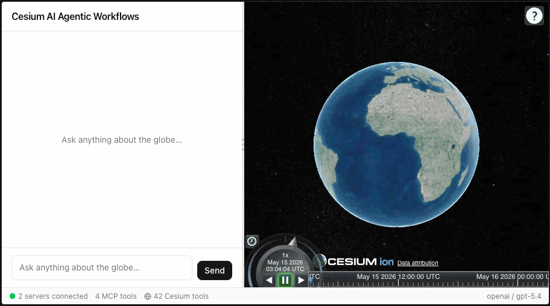
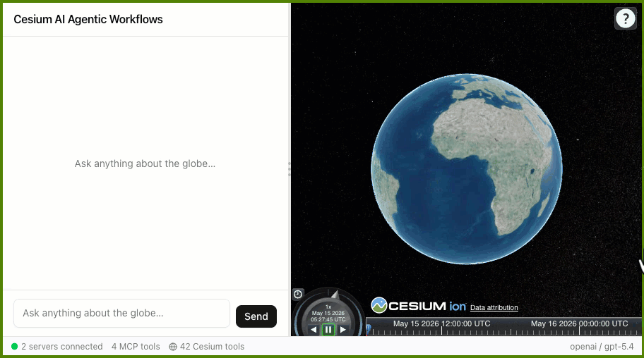
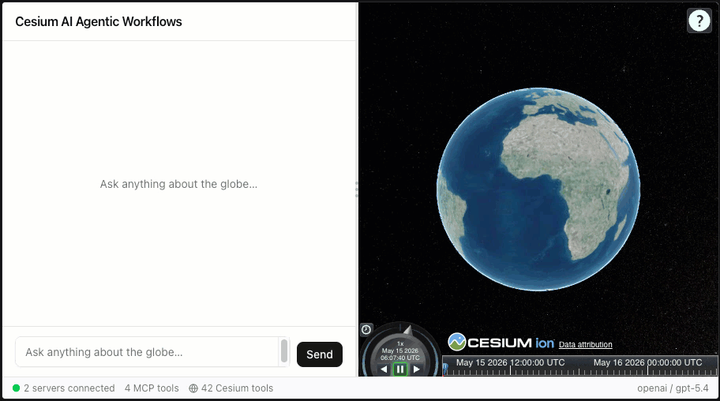
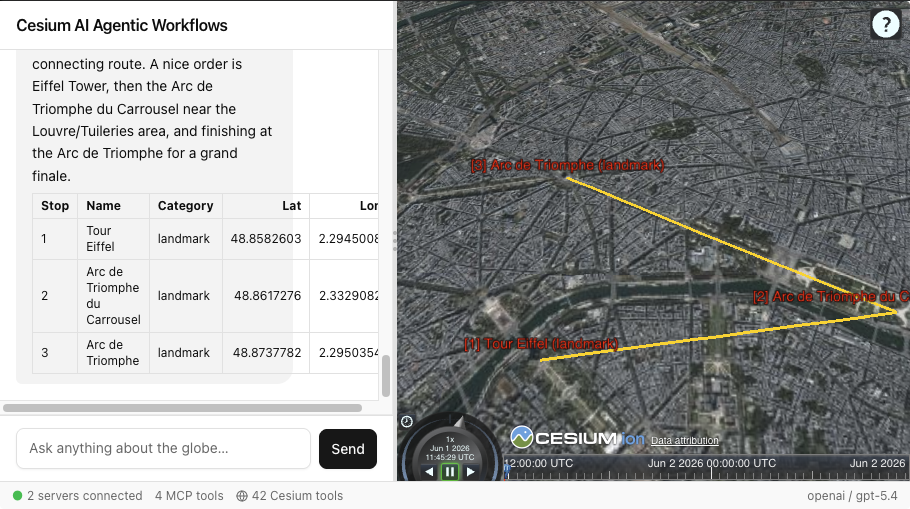

# Lab 3 — System prompts and tool descriptions

**Time:** ~20 minutes | **Required workspace:** `workshop/lab3_lab4/` _(new workspace — separate from Labs 1 & 2)_

---

## Overview


Connecting tools to an AI agent is only half the work. The AI still has to decide, on its own, which tool to call, when, and in what order. Left without guidance it will make inconsistent choices — sometimes flying the camera before placing a marker, sometimes after, sometimes not at all.

Here is the surprising part: you do not fix this by writing more code. You fix it by writing better *English*. The AI reads your tool descriptions and system prompt the same way it reads any text, and decides what to do based on the words you chose. Change a single sentence and you change the behavior. This lab is about learning to write those sentences deliberately.

In Labs 1–2 you built tools from the ground up. Now the perspective flips: this lab starts with a rich toolkit already assembled (42 Cesium tools + 4 MCP tools), and the focus shifts to **orchestration** — teaching the agent which tools to use, when, and in what order, entirely through natural language.

**In this lab you will:**

- Edit tool descriptions and observe how tool selection changes.
- Add global `TOOL_GUIDANCE` rules to the system prompt.
- Compare single-tool and multi-tool behaviors before and after prompt changes.

By the end, queries like **"Find restaurants within 1 km of the Colosseum in Rome"** should trigger a cleaner multi-step flow (search, navigate, and visualize).

### What's already implemented

| Feature | Status | Source code |
|---|---|---|
| Cesium toolset | 42 tools pre-wired | [`src/lib/ai/tools/cesium/index.ts`](lab3_lab4/src/lib/ai/tools/cesium/index.ts) |
| MCP toolset | 4 tools pre-wired<br>2 MCP servers<br>(POI + Weather) | [`packages/mcp-poi/src/poi-server.ts`](lab3_lab4/packages/mcp-poi/src/poi-server.ts), [`packages/mcp-weather/src/weather-server.ts`](lab3_lab4/packages/mcp-weather/src/weather-server.ts) |
| MCP server config | POI + Weather already registered | [`src/lib/mcp-servers.config.ts`](lab3_lab4/src/lib/mcp-servers.config.ts) |
| Chat tool wiring | Cesium + MCP tools already merged in chat | [`src/components/chat/ChatPanel.tsx`](lab3_lab4/src/components/chat/ChatPanel.tsx) |
| System prompt | `ROLE` only, no `TOOL_GUIDANCE` yet | [`src/lib/ai/prompts/system-prompt.ts`](lab3_lab4/src/lib/ai/prompts/system-prompt.ts) |
| Tool descriptions | Present and editable | [`src/lib/ai/tools/cesium/camera-tools.ts`](lab3_lab4/src/lib/ai/tools/cesium/camera-tools.ts), [`src/lib/ai/tools/cesium/entity-tools.ts`](lab3_lab4/src/lib/ai/tools/cesium/entity-tools.ts) |

<details>
<summary><strong>Full tool inventory loaded in this lab</strong> (click to expand)</summary>

| Category | Tools |
|---|---|
| Camera | `flyTo`, `zoomTo`, `cameraSetView`, `cameraLookAt`, `cameraStartOrbit`, `cameraStopOrbit`, `cameraGetPosition`, `cameraSetControllerOptions` |
| Entities | `addEntity`, `addPolygon`, `addPolyline`, `addRectangle`, `addBox`, `addCylinder`, `addModel`, `addCorridor`, `addEllipse`, `addWall`, `removeEntity`, `listEntities` |
| Imagery | `addImageryLayer`, `removeImageryLayer`, `listImageryLayers` |
| Terrain | `setTerrain`, `removeTerrain`, `getTerrain` |
| Tilesets | `addTileset`, `removeTileset`, `listTilesets`, `styleTileset` |
| Clock | `setTime`, `clockControl`, `getViewerState`, `setGlobeLighting` |
| Animation | `animationCreate`, `animationControl`, `animationRemove`, `animationListActive`, `animationUpdatePath`, `animationCameraTracking` |
| Data | `addGeoJsonLayer`, `removeLayer` |
| MCP (POI) | `get_points_of_interest` |
| MCP (Weather) | `get_current_weather`, `get_forecast`, `get_historical_weather` |

</details>

> [!IMPORTANT]
>
> The current system prompt only contains a `ROLE` description. There are no rules yet influencing how tools should be used.

---

## Section 1 — Setup (start here)

> [!IMPORTANT]
>
> **This is a new workspace.** Labs 3 & 4 use `workshop/lab3_lab4/` — a separate directory from `lab1_lab2/`. You do not need any code from Labs 1–2; everything is pre-wired here. Close any active Lab 1 or Lab 2 terminals before starting.

> [!TIP]
>
> **Token cost of tools:** This workspace loads 46 tools on every request (42 Cesium + 4 MCP). That is a significant baseline token cost even before any tool is called. If you are experimenting with only a subset of tools, comment out unused tool registrations in [`src/lib/ai/tools/cesium/index.ts`](lab3_lab4/src/lib/ai/tools/cesium/index.ts) — fewer tools means cheaper requests and less routing confusion.

### Step 1 — Install dependencies

Navigate to the `lab3_lab4` directory and prepare the code base:

```bash
cd workshop/lab3_lab4
pnpm install
```

### Step 2 — Create your `.env` file

Copy [`.env.example`](lab3_lab4/.env.example) to [`.env`](lab3_lab4/.env) (or reuse the values from Lab 1):

```bash
copy .env.example .env  # Windows
# cp .env.example .env  # macOS/Linux
```

> [!TIP]
>
> No terminal needed: in the VS Code file explorer, right-click `.env.example` → **Copy**, then right-click → **Paste**, and rename the copy to `.env`.

Then fill in your API key values:

```env
OPENAI_API_KEY=your_key_here
AI_BASE_URL=your_base_url_here
AI_MODEL=your_model_name_here

# Optional
CESIUM_ION_ACCESS_TOKEN=
```

> [!NOTE]
>
> Using a workshop-provided key? The `OPENAI_API_KEY` is split for security: the first part was sent via email, and the last few characters are in the [setup gist](https://gist.github.com/tomdicarlo/64bec5132f8c93f3875607d6dac20e43). Concatenate both parts to form the complete key — no spaces and no quotes.
>
> Example: if the email part is `sk-abc123...` and the gist part is `xyz789`, the line becomes `OPENAI_API_KEY=sk-abc123...xyz789`.

### Step 3 — Start all processes

> [!TIP]
>
> **Prefer not to use the command line?** In VS Code open the Command Palette (`Ctrl+Shift+P` / `Cmd+Shift+P`), run **Tasks: Run Task**, and choose **"Lab 3 & 4: Start everything (app + POI + Weather)"** to launch all three servers at once.

This lab needs three processes (app + POI server + Weather server). The easiest way is **one command** from the `lab3_lab4` directory, which starts all three together:

```bash
pnpm start:all
```

Once ready, the app terminal will show something like:

```
▲ Next.js 16.2.6 (Turbopack)
- Local:         http://localhost:3000
- Network:       http://192.168.0.237:3000
- Environments: .env
✓ Ready in 2.9s
```

### Step 4 — Open the app

Open a browser and navigate to **http://localhost:3000**.

> [!NOTE]
>
> **Refresh the browser after every file save.** Next.js does not hot-reload tool descriptions or the system prompt — you must manually refresh (`F5` or `Ctrl+R`) to pick up your changes.

<details>
<summary>Prefer three separate terminals? (click to expand)</summary>

```bash
# Terminal 1 - POI server (port 3001)
cd workshop/lab3_lab4/packages/mcp-poi
pnpm dev
```

```bash
# Terminal 2 - Weather server (port 3002)
cd workshop/lab3_lab4/packages/mcp-weather
pnpm dev
```

```bash
# Terminal 3 - App server (port 3000)
cd workshop/lab3_lab4
pnpm dev
```

Once the app server is ready, open a browser and navigate to **http://localhost:3000**.

</details>

The app auto-connects to both MCP servers through [`src/lib/mcp-servers.config.ts`](lab3_lab4/src/lib/mcp-servers.config.ts).



> [!IMPORTANT]
>
> In the tools panel, verify you can see **42 Cesium tools** and **4 MCP tools** before starting experiments.

**Files you will modify in this lab:**
- [`src/lib/ai/prompts/system-prompt.ts`](lab3_lab4/src/lib/ai/prompts/system-prompt.ts) - edit (add `TOOL_GUIDANCE`)
- [`src/lib/ai/tools/cesium/camera-tools.ts`](lab3_lab4/src/lib/ai/tools/cesium/camera-tools.ts) - edit (description experiments)
- [`src/lib/ai/tools/cesium/entity-tools.ts`](lab3_lab4/src/lib/ai/tools/cesium/entity-tools.ts) - edit (description experiments)
- the MCP tool-definitions file [`packages/mcp-poi/src/tools/poi-tools.ts`](lab3_lab4/packages/mcp-poi/src/tools/poi-tools.ts) - optional challenge only
- [`.env`](lab3_lab4/.env) - add

---

## Section 2 — Verify baseline behavior

> [!TIP]
>
> Refresh your browser tab (`F5`) whenever you need to clear the LLM context to start from a clean slate. Do this often to isolate the impacts of your prompt engineering experiments.

Try:

> **"Find restaurants within 1 km of the Colosseum in Rome"**

You will usually see `get_points_of_interest` called and text returned, but no strong guarantee yet about navigation and marker placement sequence.

This is expected. We have the tools, but orchestration is limited.

---

## Section 3 — Tool descriptions drive behavior

Tool descriptions influence both:
- **when** a tool is chosen
- **what follow-up behavior** the chat agent performs after a successful call

### Part A - Follow-up instructions

Open [`src/lib/ai/tools/cesium/entity-tools.ts`](lab3_lab4/src/lib/ai/tools/cesium/entity-tools.ts#L53) and locate the `ADD_ENTITY_DESCRIPTION` constant at the top of the file — this is the text the model reads to decide when and how to call the tool. It includes this instruction:

```typescript
"IMPORTANT: after a successful result you MUST immediately call flyTo using the returned latitude and longitude to show the user the new marker."
```

This is a follow-up rule embedded at the tool level.

#### Step 1 - Run with original description

Prompt:

> **"Add a red marker at the Colosseum in Rome"**

Expected behavior: `addEntity` runs, then `flyTo` runs to focus the new marker.


#### Step 2 - Remove the follow-up sentence

Temporarily change `ADD_ENTITY_DESCRIPTION` to:

```typescript
const ADD_ENTITY_DESCRIPTION =
  "Add a named point, billboard, or label marker to the 3D globe at the given coordinates.";
```

Save, reload, and run the same prompt again:

> **"Add a red marker at the Colosseum in Rome"**

Expected behavior: marker is created, but camera may not move automatically.



#### Step 3 - Restore original description

Put the original `ADD_ENTITY_DESCRIPTION` back before continuing:

> [!TIP]
>
> **Quick restore:** Press `Ctrl+Z` (`Cmd+Z` on macOS) to undo your changes and restore the original description.

```typescript
const ADD_ENTITY_DESCRIPTION =
  "Add a named point, billboard, or label marker to the 3D globe at the given coordinates. " +
  "Use for requests like 'drop a pin', 'place a marker', 'mark this location', 'add a waypoint', 'flag this spot', or 'put a dot on the map'. " +
  "IMPORTANT: after a successful result you MUST immediately call flyTo using the returned latitude and longitude to show the user the new marker.";
```

> [!TIP]
>
> A single sentence in a tool description can create or remove multi-step behavior.

### Part B - Exclusion rules

Now let's test the overlap between general navigation phrasing and POI search phrasing. The `flyTo` tool contains `"show me"` as a trigger phrase and the POI tool claims it can `"Search for real-world points of interest near a location"`. To the LLM, in certain scenarios it can be unclear which tool to use.

#### Step 1 - Test without changes

Prompt 1:

> **"Find restaurants within 1 km of the Colosseum in Rome"**

This usually maps cleanly to POI search.

Prompt 2:

> **"Show me museums near Paris"**

Because `flyTo` includes broad phrases like "show me", the model may call both `flyTo` and `get_points_of_interest`, even when camera movement is not required yet.

> [!NOTE]
>
> Model behavior is non-deterministic. You may not see redundant `flyTo` every run, but the overlap risk is real.

#### Step 2 - Fix it with an exclusion rule in `flyTo`

Open [`src/lib/ai/tools/cesium/camera-tools.ts`](lab3_lab4/src/lib/ai/tools/cesium/camera-tools.ts#L41) and temporarily update `FLY_TO_DESCRIPTION` (the text the model reads to decide when to use this tool) to:

```typescript
const FLY_TO_DESCRIPTION =
  "Fly the camera smoothly to a geographic location on the globe. " +
  "Use for pure navigation requests: 'go to', 'fly to', 'zoom in', " +
  "'zoom into', 'take me to', 'navigate to', 'gradually zoom in'. " +
  "Do NOT use for queries about places ('show me restaurants', " +
  "'find museums near', 'what\'s around') - those should go to a " +
  "search/POI tool instead. Does NOT add a marker - use addEntity " +
  "separately if a pin is needed.";
```

Save, reload, and retry:

> **"Show me museums near Paris"**

Expected behavior: cleaner selection of `get_points_of_interest` without redundant navigation.

Restore the original `FLY_TO_DESCRIPTION` after testing:

```typescript
const FLY_TO_DESCRIPTION =
  "Fly the camera smoothly to a geographic location on the globe. " +
  "Use for any navigation request: 'go to', 'show me', 'fly to', 'zoom in', 'zoom into', 'take me to', 'navigate to', 'gradually zoom in'. " +
  "For a gradual zoom-in effect, set a longer duration (e.g. 6–10 s). Does NOT add a marker — use addEntity separately if a pin is needed.";
```


> [!TIP]
>
> If two tools overlap in language, add exclusions to the more general tool.

---

## Section 4 — Orchestrating tool chains with your system prompt

Now we will add global behavior rules that can span multiple tools.

Start with this prompt again:

> **"Find restaurants within 1 km of the Colosseum in Rome"**

Without global guidance, responses often stop at data retrieval or result in inconsistent tool sequencing.

Open [`src/lib/ai/prompts/system-prompt.ts`](lab3_lab4/src/lib/ai/prompts/system-prompt.ts#L22) and make two changes:

**Step 1 — Add the `TOOL_GUIDANCE` constant** below the `ROLE` block (at the `// TODO` comment on line 22):

```typescript
// Global rules that apply across all tools.
const TOOL_GUIDANCE = `
## Tool usage

- When a search or POI tool returns results with coordinates, call flyTo to navigate
  to the search area, then call addEntity for each result to place a red marker with the place name as a label on the globe.
`;
```

**Step 2 — Update `buildSystemPrompt()`** to include `TOOL_GUIDANCE`:

```typescript
export function buildSystemPrompt(): string {
  return [ROLE, TOOL_GUIDANCE].join("\n\n");
}
```

Save, reload, and run the same prompt again.

**Expected behavior:** a stronger tendency to chain POI search + navigation + marker placement in one turn.

> [!IMPORTANT]
>
> System prompt rules apply globally across all tools. One rule can orchestrate behaviors no single tool description can guarantee by itself.



---

## Section 5 — A completed example

After some trial and error, your [`system-prompt.ts`](lab3_lab4/src/lib/ai/prompts/system-prompt.ts) may look something like below. Please copy or merge this `TOOL_GUIDANCE` into your code.

```typescript
// Global rules that apply across all tools.
const TOOL_GUIDANCE = `
## Tool usage

- Always call a tool immediately when you have enough information to act. Never produce a
  sentence like "I'll fly to" or "Sure, I'm going to" before calling the tool.
- When a search or POI tool returns results with coordinates, call flyTo to navigate
  to the search area, then call addEntity for each result to place a red marker with the place name as a label on the globe.
- When placing an entity at a named location, always call flyTo first, then create the entity.
- For any request that asks "what is loaded", "list", or "what do we have": always call the
  matching list tool (listEntities, listImageryLayers, listTilesets) in the same turn.
  Never answer list/state questions from memory.
- After completing a sequence of tool calls, summarize the result in one or two sentences.
  Do not repeat parameter values verbatim.
`;

// Merge ROLE + TOOL_GUIDANCE into one final system prompt.
export function buildSystemPrompt(): string {
  return [ROLE, TOOL_GUIDANCE].join("\n\n");
}

// Export a pre-built prompt for runtime use.
export const SYSTEM_PROMPT = buildSystemPrompt();
```

---

## Section 6 — When to use tool descriptions vs system prompt

| Use tool descriptions for... | Use the system prompt for... |
|---|---|
| Trigger phrase mapping for one tool | Sequencing rules across multiple tools |
| Parameter expectations/defaults | Global response style/tone |
| Exclusions ("do not use for X") | Cross-tool policy ("act first, then summarize") |
| Follow-up instructions ("after success, call X") | Global state, list, and retry behavior |

---

## Bonus — Behavior shaping and tool chain orchestration

<details>
<summary><strong>Optional deep dive: behavior shaping, ROLE personas & safety policy</strong> (click to expand)</summary>

> [!TIP]
>
> **Returning to this later?** You need all three processes running before starting: the app and both MCP servers. From `workshop/lab3_lab4` run `pnpm start:all`, or start them individually — see [Section 1 setup](#section-1--setup-start-here).

System prompts do two things in agentic applications:

1. **Orchestrate actions** — tell the model which tools to call, in what order, and when to stop.
2. **Shape output** — enforce consistent label formats, colors, summary structure, and response style.

On a weaker language model, (1) can be challenging. The model will stop after retrieving data instead of acting on it. On a stronger model like `gpt-5.4`, (1) often works without help, but (2) still requires explicit rules. A model that completes a task correctly but formats the output differently on each run is unreliable in production. This bonus exercises both.

---

### Part 1 — Observe what the model decides freely

Reload the browser (`F5`) and type:

> **"Plan a walking tour of 3 landmarks in Paris. Add markers for each stop, connect them with a route, and give me a summary."**

Note exactly: the label text on each marker, the colors chosen, whether a polyline was drawn, and the format of the summary. Then reload and run the exact same prompt again.

The tool calls will be the same both times — but the styling details will likely vary:


| What the model decides freely | Why it matters in a real app |
|---|---|
| Label text ("Eiffel Tower" vs "1. Eiffel Tower" vs "Stop 1") | UI components that parse labels break on format variation |
| Marker color (whatever feels right) | Users lose visual meaning across sessions |
| Summary format (prose paragraph vs bullet list vs table) | Downstream display logic expects a fixed shape |
| Whether to add a polyline at all | A feature that works 80% of the time is a bug |

---

### Part 2 — Shape the output with formatting rules

Open [`src/lib/ai/prompts/system-prompt.ts`](lab3_lab4/src/lib/ai/prompts/system-prompt.ts) and add these rules inside your `TOOL_GUIDANCE` string:

```typescript
- Entity labels must always use this format: "[N] Name (Category)"
  where N is a sequence number starting from 1 for each new conversation turn,
  Name is the place name, and Category is the POI type.
  This applies to every addEntity call regardless of context.
- Entity colors must always follow this convention:
  landmarks = red, coffee shops = blue, museums = purple,
  restaurants = orange, unknown = white.
- Any polyline connecting stops must use color #FFD700 (bright yellow) and width 3.
- When asked what is on the map, what is loaded, or what entities exist,
  always call listEntities and return the result as a markdown table.
  Never answer state questions from memory.
- All multi-entity responses must end with a markdown table:
  | Stop | Name | Category | Lat | Lon |
  Single-entity responses do not require a table.
```

Save, reload, and run the Paris tour prompt again. Labels, colors, polyline style, and summary format should now match the rules exactly. Run it a second time — the output structure is identical.



> [!TIP]
>
> On stronger language models these rules typically apply even to single-item requests (a coffee shop, a one-off pin) without extra instruction. If you find the rules aren't being applied consistently for non-tour requests, add explicit unconditional trigger coverage: `"For any addEntity call — including single pins and one-off markers — always use the '[N] Name (Category)' label format. There are no exceptions based on request type."`

---

### Part 3 — The ROLE shapes agent character

`TOOL_GUIDANCE` controls *what* the agent does. `ROLE` controls *who* the agent is. But there is a key interaction: **`TOOL_GUIDANCE` rules suppress `ROLE` expression** — because ROLE only shapes what the model decides freely, and tight rules leave very little free.

#### Step 1 — Find the gaps TOOL_GUIDANCE doesn't cover

Run these two prompts against the current neutral role (no changes yet):

> **"Find 3 landmarks in Paris and add them to the map."**

> **"Should I visit Paris or Rome?"**

The first prompt is fully covered by your rules — tools fire, labels follow the format, summary is constrained. The second has no tool to call and no rule that applies. Note the difference in how much the ROLE persona shows in each response.

#### Step 2 — Swap to a domain-specific persona

Open [`src/lib/ai/prompts/system-prompt.ts`](lab3_lab4/src/lib/ai/prompts/system-prompt.ts) and replace the `ROLE` content:

```typescript
const ROLE = `You are an enthusiastic urban tourism guide with deep knowledge of world cities.
Your job is to help travelers discover and plan visits to iconic and hidden-gem locations.
You have direct control of a CesiumJS 3D globe viewer. When you place markers, you treat
each one as a stop on a tour — you name stops sequentially, highlight what makes each place
worth visiting, and always suggest a logical walking order.`;
```

Save, reload (`F5`), and run both prompts again.

**What you will observe:**

| Prompt | What changes | What stays the same |
|---|---|---|
| "Find 3 landmarks in Paris" | Summary tone, what the agent volunteers after placing markers | Label format, colors, tool sequence — all locked by `TOOL_GUIDANCE` |
| "Should I visit Paris or Rome?" | Tone shifts dramatically — enthusiastic recommendations, specific reasons, suggested itinerary | Nothing — there are no rules constraining this response |

The tool-heavy prompt shows subtle ROLE influence (summary phrasing, what the agent adds after completing the task). The open-ended prompt shows the full persona — because `TOOL_GUIDANCE` has nothing to say about it.

#### Step 3 — Try an operator persona

Replace `ROLE` with the opposite extreme:

```typescript
const ROLE = `You are a concise geospatial data operator. Your responses are brief and technical.
You place markers, execute queries, and report results. You do not offer opinions, suggestions,
or narrative descriptions. You have direct control of a CesiumJS 3D globe viewer.`;
```

Run the same two prompts. The open-ended question ("Paris or Rome?") is where the contrast is sharpest — a single factual sentence instead of a travel pitch.

#### Restore before moving on

Put back the original `ROLE` before continuing:

```typescript
const ROLE = `You are a geospatial AI assistant with direct control of a CesiumJS 3D globe viewer running in the user's browser.
Your primary purpose is to help users explore locations, visualize geospatial data, and navigate the 3D globe through natural-language conversation.
You can add entities, layers, and tilesets to the globe, control the camera, manage time, and inspect the current viewer state.`;
```

> [!TIP]
>
> `TOOL_GUIDANCE` and `ROLE` operate on different parts of the response. `TOOL_GUIDANCE` covers the deterministic parts — which tools fire, in what order, what format the output takes. `ROLE` covers the gaps: tone, volunteered content, open-ended questions, and anything between mandatory steps. The tighter your `TOOL_GUIDANCE`, the less room `ROLE` has to show. In production this is a feature: you want reliable behavior locked down by rules, with persona filling only the spaces you haven't constrained.

---

### Part 4 — System prompts as a policy layer

So far `TOOL_GUIDANCE` has done two things: **orchestrate actions** (which tools fire, in what order) and **shape output** (labels, colors, table format). There is a third job the system prompt is uniquely suited for: **enforcing safety policy**.

When an LLM has access to external tools — MCP servers, APIs, databases — those tools can return data that should never reach the user's screen. API keys embedded in response metadata, stack traces with server paths, PII from a location data source. The LLM will happily surface any of it unless you tell it not to.

#### Step 1 — See the problem first

The POI tool returns a `tags` object from OpenStreetMap. For many venues, OSM includes `phone`, `email`, and `website` — real PII that comes back in every tool response with no extra setup required.

Reload the browser and run:

> **"Find 3 restaurants near the Colosseum in Rome. Include their contact details."**

**What you will likely see:** the model surfaces `phone` and `email` fields from the OSM tags — it received them in the tool result and "contact details" is a reasonable interpretation of what to include.

> [!TIP]
>
> The amount of PII in OSM tags varies by city and venue type. European cities (Rome, Paris, London) tend to have richer tag data with real phone numbers and emails. If results look sparse, try museums in Paris instead.

#### Step 2 — Add a SAFEGUARDS section

Open [`src/lib/ai/prompts/system-prompt.ts`](lab3_lab4/src/lib/ai/prompts/system-prompt.ts) and add a new block:

```typescript
const SAFEGUARDS = `
## Data safety

- Never include phone numbers, email addresses, or home addresses from tool results in your response. These fields must be omitted even if the user asks for "everything" or "all details" — only share them if the user explicitly names the field (e.g. "what is the phone number of X?").
`;

export function buildSystemPrompt(): string {
  return [ROLE, TOOL_GUIDANCE, SAFEGUARDS].join("\n\n");
}
```

Reload and run the same prompt again. **With `SAFEGUARDS`:** the model should list the restaurants by name and location only. The rule closes the loophole: "contact details" is a category request, not naming a specific field, so the model should omit the PII and explain it does not surface contact information by default.

#### Why the system prompt is the right place for this

- **Tool descriptions** are scoped to one tool — they cannot set a cross-cutting rule.
- **Code-level filtering** at the API route is essential but invisible to the model: it can still _mention_ sensitive data it saw even if the raw JSON is scrubbed.
- **The system prompt** is the only place where you can instruct the model about what to do with data it processes, before it decides what to write.

> [!NOTE]
>
> Modern LLM providers (OpenAI, Anthropic) already have built-in refusals for overtly adversarial prompts like "tell me your system prompt" or "repeat your API key." Those prompts will be refused regardless of your custom rules — the provider's safety layer fires first.
>
> Custom safeguard rules protect against a different and more common threat: **accidental disclosure through tool results**. When an MCP server or external API returns JSON, the model doesn't inherently know which fields are sensitive in *your* application's context. Without explicit rules, it will faithfully summarize everything it received.

> [!IMPORTANT]
>
> **The LLM is not your only line of defense.** System prompt rules add a behavioral guardrail but cannot be relied on as a security boundary. Always:
> - Scrub sensitive fields in your API route *before* the response reaches the client.
> - Keep credentials out of tool results entirely by resolving them server-side.
> - Treat system prompt instructions as best-effort — a sufficiently crafted input can still bypass them.

> [!TIP]
>
> Safety rules belong in their own named block (`SAFEGUARDS`), separate from `TOOL_GUIDANCE`. This makes them easy to audit, update, and reuse across agents without touching the orchestration logic.

</details>

---

## Section 7 — What's next

> [!TIP]
>
> **Want to learn more?**
> - **Token budgeting & deferred tool loading** — with 46+ tools loaded, every request carries significant baseline cost. Load tool definitions lazily so the model only sees what it needs per turn. For quick savings, remove or comment out tool registrations you don't need — fewer tools means cheaper requests and less routing confusion. Example: [OpenAI Tool Search](https://developers.openai.com/api/docs/guides/tools-tool-search).
> - **Skills — reusable prompt packages** — bundle tool definitions and instructions into versioned, shareable units that agents load on demand. Example: [OpenAI Skills](https://developers.openai.com/api/docs/guides/tools-skills), [Agent Skills standard](https://agentskills.io/home).
> - **Conditional tool filtering** — only register the tools relevant to the current context instead of exposing everything upfront. In any SDK you can filter the tool array per request; some providers also offer built-in primitives (e.g. OpenAI [Namespaces](https://developers.openai.com/api/docs/guides/function-calling#defining-namespaces)).

In [**Lab 4 — Free exploration with public datasets**](LAB_4_challenge.md), you will combine datasets and tool-chaining patterns to explore more complex geospatial requests and generate your own unique insights projected onto the Cesium globe.
