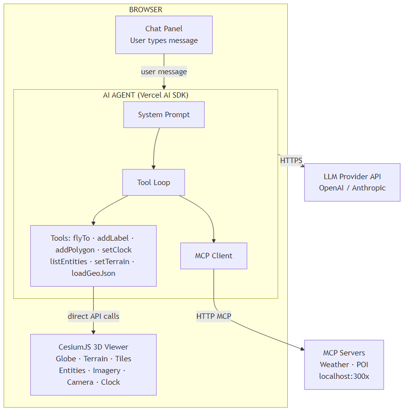

# Building Your First AI-Driven Geospatial App with LLMs and Cesium

**Total time: 1 hour 20 minutes**

---

## Welcome!


Most AI chatbots can only talk. They can tell you the weather, describe a location, or summarize a document — but they can't *do* anything. They can't move a map, fetch live data, or place a pin on a globe.

This workshop is about closing that gap — by the end you will have built something that feels more like a co-pilot than a chatbot.

In this workshop you will learn how to:

- build an app that combines AI agents with a 3D geospatial context
- enrich those agents with external data
- leverage AI to generate new information
- enable AI to dynamically visualize insights on the Cesium globe

You will work through four labs, starting with a mostly blank starter CesiumJS application and ending with a full agent that chains Cesium commands, external MCP servers, and a real weather API in a single conversational turn.


---

## Prerequisites

Please take a moment to prepare your system ahead of the workshop. If you encounter any issues, please ask a workshop facilitator for help at the start of the session.

| Requirement | Notes |
|---|---|
| **[VS Code](https://code.visualstudio.com/)** | Download from [code.visualstudio.com](https://code.visualstudio.com/). |
| **Node.js ≥ 22 LTS** | Download from [nodejs.org](https://nodejs.org/).<br>Check version with: `node --version`. |
| **pnpm 9.15.5** | Install Node.js first.<br>`npm install -g pnpm@9.15.5`<br>(or run `corepack enable` and it will be installed automatically) |
| **An OpenAI or Anthropic API key** | Will be provided during the workshop. |
| **Familiarity with the command line** *(helpful, not required)* | A few `pnpm` commands are used. If you prefer not to use a terminal, VS Code can run everything for you with one click — see [Running the apps](#running-the-apps). |
| **Cesium ion token** *(optional)* | [ion.cesium.com](https://ion.cesium.com) → My Tokens → Create token<br>The app works without one, but some imagery/terrain features may be limited. |

---

## Schedule

| # | Lab | Focus | Time |
|---|---|---|---|
| — | Intro & Prerequisites | Welcome & environment check. | 5 min |
| 1 | [Lab 1 — Our first Cesium tool](LAB_1.md) | Create a `flyTo` camera tool from scratch. | 15 min |
| 2 | [Lab 2 — Build an MCP server](LAB_2.md) | Build a points-of-interest (POI) MCP server and connect it to the agent. | 20 min |
| 3 | [Lab 3 — System prompts and tool descriptions](LAB_3.md) | Shape agent behavior with `TOOL_GUIDANCE` and tool descriptions. | 20 min |
| 4 | [Lab 4 — Free exploration with public datasets](LAB_4_challenge.md) | Explore public datasets.<br>Build your own MCP server(s).<br>Generate new AI insights.<br>Show us your creativity! | 20 min |

> [!TIP]
>
> We have provided a starter app for each lab. You will be adding the missing pieces. See 'Workspace structure' below for details.

---

## Environment setup

Each lab folder contains a `.env.example` file. Copy it to `.env` and fill in your API key before running:

```bash
cd workshop/lab1_lab2   # or workshop/lab3_lab4
copy .env.example .env  # Windows
# cp .env.example .env  # macOS/Linux
```

Then open `.env` and fill in:

```
OPENAI_API_KEY=             # will be provided during the workshop
AI_BASE_URL=                # leave blank unless using a proxy/custom endpoint
AI_MODEL=gpt-5.4            # change if using a different model

CESIUM_ION_ACCESS_TOKEN=    # optional
```

> [!NOTE]
>
> Using a workshop-provided key? The `OPENAI_API_KEY` is split for security: the first part was sent via email, and the last few characters are in the [setup gist](https://gist.github.com/tomdicarlo/64bec5132f8c93f3875607d6dac20e43). Concatenate both parts to form the complete key — no spaces and no quotes.
>
> Example: if the email part is `sk-abc123...` and the gist part is `xyz789`, the line becomes `OPENAI_API_KEY=sk-abc123...xyz789`.

---

<details>
<summary><strong>Running the apps</strong> (click to expand)</summary>

Each lab needs the Next.js app running, plus one or more MCP servers. You have two ways to start everything.

### Option A — One click in VS Code (no terminal needed)

1. Open the Command Palette: `Ctrl+Shift+P` (Windows/Linux) or `Cmd+Shift+P` (macOS).
2. Type **Tasks: Run Task** and press Enter.
3. Pick the task for your lab:
   - **Lab 1 & 2: App (port 3000)** — Lab 1 only needs the app.
   - **Lab 1 & 2: Start everything (app + POI server)** — use from Lab 2 onward.
   - **Lab 3 & 4: Start everything (app + POI + Weather)**

VS Code starts every process in its own panel. To stop them, click the trash-can icon on each terminal panel (or run **Tasks: Terminate Task**).

> [!IMPORTANT]
>
> In **Lab 1** you only need the app running — do **not** start the POI server yet. The POI server stays off until you build its tool in Lab 2, so starting it early (via "Start everything" or `pnpm start:all`) will show an error in that terminal. For Lab 1, use the **Lab 1 & 2: App (port 3000)** task or `pnpm dev`.

> Run `pnpm install` once in the lab folder first (Option B step 1). You only need to do this a single time per lab folder.

### Option B — One command in a terminal

From the lab folder, a single command starts the app and all of its MCP servers together:

```bash
cd workshop/lab1_lab2   # or workshop/lab3_lab4
pnpm install            # first time only
pnpm dev                # Lab 1 only (app without MCP servers)
pnpm start:all          # Lab 2 onward (app + all MCP servers)
```

> [!IMPORTANT]
>
> In **Lab 1**, use `pnpm dev` instead of `pnpm start:all`. The POI server has no tools registered yet, so `start:all` will show an error in that terminal.

Open http://localhost:3000 once everything is running. The status bar turns green when the MCP servers connect.

> [!NOTE]
>
> Each lab's Setup section also lists the individual per-process commands if you prefer to run each server in its own terminal.

</details>

---

<details>
<summary><strong>Workspace structure</strong> (click to expand)</summary>

Labs 1–2 and Labs 3–4 each have their own starter app located in the folders `lab1_lab2` and `lab3_lab4`. Both starter apps are structurally the same. Labs 3–4 simply have more tools and an extra MCP server pre-wired.

### `lab1_lab2/` — Labs 1 & 2

```
lab1_lab2/
├── src/
│   ├── app/                          # App's page structure (Next.js)
│   ├── components/
│   │   ├── cesium/                   # The Cesium viewer and tools
│   │   ├── chat/                     # The AI chat panel
│   │   │   └── ChatPanel.tsx         ← Lab 1 & 2: wire tools here
│   │   └── ...
│   └── lib/
│       ├── ai/
│       │   ├── prompts/
│       │   │   └── system-prompt.ts  # AI system prompt (minimal in Lab 1)
│       │   └── tools/
│       │       └── cesium/
│       │           └── index.ts      ← Lab 1: the Cesium tools **barrel** (cesium/index.ts) — export your new tool
│       ├── cesium/
│       │   └── ...                   ← Lab 1: create camera.ts here
│       └── mcp-servers.config.ts     ← Lab 2: register POI server
├── packages/
│   └── mcp-poi/                      ← Lab 2: build this entire MCP package
│       └── src/
│           ├── poi-server.ts         # Server entry point (mcp-poi/src/poi-server.ts)
│           ├── overpass.ts           # Overpass API client
│           └── tools/poi-tools.ts    # Tool definitions (mcp-poi/src/tools/poi-tools.ts)
└── .env                              # API keys
```

> [!NOTE]
>
> [OpenStreetMap Overpass API Documentation](https://wiki.openstreetmap.org/wiki/Overpass_API)

### `lab3_lab4/` — Labs 3 & 4

```
lab3_lab4/
├── src/
│   ├── app/                          # App's page structure (Next.js)
│   ├── components/                   # Same as lab1_lab2
│   └── lib/
│       ├── ai/
│       │   ├── prompts/
│       │   │   └── system-prompt.ts  ← Lab 3: add TOOL_GUIDANCE here
│       │   └── tools/
│       │       └── cesium/
│       │           ├── camera-tools.ts   ← Lab 3: edit descriptions
│       │           ├── entity-tools.ts   ← Lab 3: edit descriptions
│       │           ├── imagery-tools.ts
│       │           ├── terrain-tools.ts
│       │           ├── tileset-tools.ts
│       │           ├── clock-tools.ts
│       │           ├── animation-tools.ts
│       │           └── data-source-tools.ts
│       └── cesium/                   # 10 helper modules (all pre-wired)
├── packages/
│   ├── mcp-poi/                      # Already built (from Lab 2 pattern)
│   │   └── src/tools/poi-tools.ts    ← Lab 3: optionally edit descriptions
│   └── mcp-weather/                  # Pre-wired weather server
│       └── src/
│           ├── open-meteo.ts
│           └── tools/weather-tools.ts
└── .env                              # API keys
```

> [!IMPORTANT]
> 
> **Key differences:** `lab1_lab2` starts with almost no tools — you build them. `lab3_lab4` starts fully wired (42 Cesium tools + 4 MCP tools) — you shape how the agent uses them.

</details>

---

<details>
<summary><strong>Architecture overview</strong> (click to expand)</summary>

### What is an AI agent?

An **agent** is an LLM that can call tools. Instead of just producing text, it can invoke functions — `flyTo`, `addLabel`, `get_current_weather` — and act on the results before responding. A single user message may trigger a chain of tool calls.

```
User: "What's the weather in Tokyo? Add a label with the temperature."

Agent:
  1. call get_current_weather(city="Tokyo")             ← MCP tool
  2. call addLabel(lat=35.68, lng=139.69, text="13°C")  ← Cesium tool
  3. call zoomTo(entity="Tokyo")                        ← Cesium tool
  4. "Done! Tokyo is currently 13°C — I've added a label on the globe."
```

### How the components connect



> [!TIP]
>
> **Key insight:** in this workshop everything runs in the browser. Tools are plain TypeScript functions that call APIs like `viewer.camera.flyTo()`, `viewer.entities.add()`, etc. directly — no serialization, no network hop to a backend. This means you can iterate instantly: change a tool definition, save, and see the effects in the next message.

### Technology choices

| Layer | Choice | Why |
|---|---|---|
| Framework | Next.js + React + TypeScript | Same code runs client and server |
| Globe | CesiumJS | Full programmatic control for agent commands |
| AI SDK | Vercel AI SDK `streamText + tool()` | Isomorphic — works in browser & server; 20+ LLM providers |
| Tool loop | AI SDK `maxSteps` | LLM→tool→LLM |
| External data | MCP servers (Streamable HTTP) | Standard protocol; AI SDK has native MCP support |
| Styling | Tailwind CSS + shadcn/ui | Fast prototyping |

</details>

---

## Troubleshooting

| Symptom | Fix |
|---|---|
| `EADDRINUSE` or port already in use | Another process is on port 3000/3001/3002. Run `npx kill-port 3000 3001 3002` or restart your machine. |
| `Cannot find module` / missing packages | Run `pnpm install` inside the lab folder (e.g. `workshop/lab1_lab2`). |
| Node.js version error | Run `node --version` — must be ≥ 22. Download from [nodejs.org](https://nodejs.org/). |
| AI returns "API key invalid" | Check your `.env` file exists (not just `.env.example`) and the key has no leading/trailing spaces. |
| Status bar stays red (MCP not connected) | Wait ~5 s after startup; if still red, check the MCP server terminal panel for errors. |

---

## After the workshop


### Share what you built

Share your experiment however you like — a screenshot, short video, or a prompt that made you laugh. The only guidelines are:

- Use the hashtag **#CesiumDevCon** on [X](https://x.com/search?q=%23CesiumDevCon) or [LinkedIn](https://www.linkedin.com/feed/hashtag/cesiumdevcon/) so your post is easy to find.
- Tag [**@CesiumJS**](https://x.com/CesiumJS) on X or the [**Cesium LinkedIn page**](https://www.linkedin.com/company/cesium-gs/) (@Cesium) so the team can see and reshare your work.

### Keep building

- Swap in your own domain data as an MCP server (earthquakes, flights, weather stations, IoT sensors, …).
- Add multi-step planning: ask the agent to _"plan a route between 5 cities"_ before executing.

### Questions?

Ask in the [Cesium Community Forum](https://community.cesium.com).
